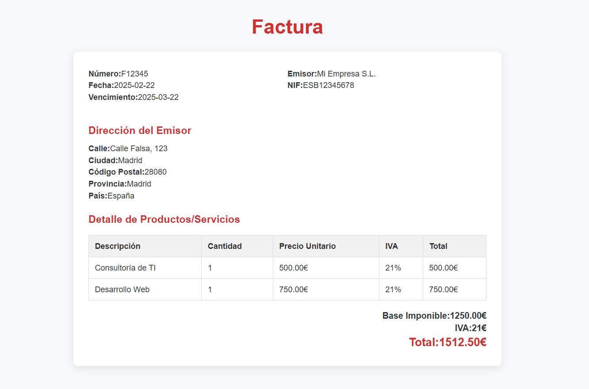

# Proyecto: Transformación de Factura XML con XSLT

## Descripción
Este proyecto incluye dos plantillas XSLT para transformar una factura en formato XML a una página HTML con un diseño moderno y claro. Se han corregido errores en la extracción de datos y se ha mejorado la presentación con CSS.

## Tecnologías utilizadas
- **XSLT**: Para transformar el XML en HTML
- **HTML y CSS**: Para estructurar y estilizar la factura
- **Markdown**: Para documentación

## Capturas de pantalla
### Código XSLT 1


### Factura renderizada en HTML


### Código XSLT 2


### Factura renderizada en HTML


## Estructura del Proyecto
```
/
├── README.md             # Documentación
├── factura.xml           # Archivo XML de la factura
├── factura1.png          # Captura de pantalla
├── factura2.png          # Captura de pantalla
├── formato1.png          # Captura XSLT
├── formato1.xslt         # Plantilla XSLT
├── formato2.png          # Captura XSLT
├── formato2.xslt         # Plantilla XSLT
├── resultado1.html       # Salida generada en HTML
├── resultado2.html       # Salida generada en HTML
```


